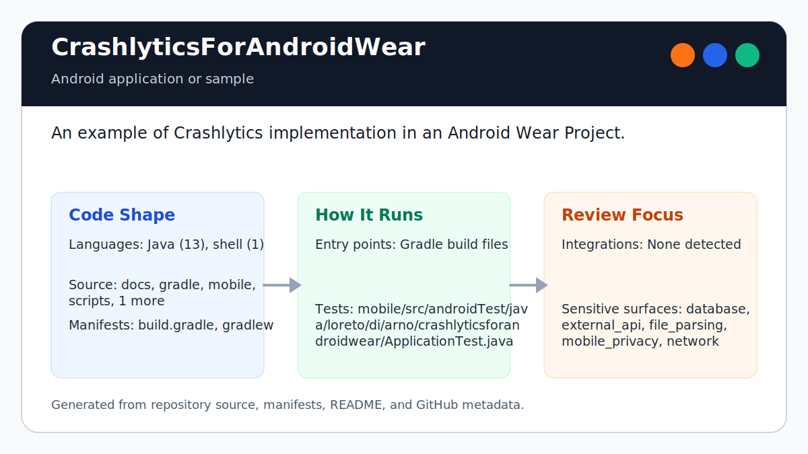

# CrashlyticsForAndroidWear

<!-- README-OVERVIEW-IMAGE -->


## Overview

`garethpaul/CrashlyticsForAndroidWear` is an Android application or sample. An example of Crashlytics implementation in an Android Wear Project.

This README is based on the checked-in source, manifests, scripts, and repository metadata on the `master` branch. The project language mix found during review was: Java (13).

## Repository Contents

- `README.md` - project overview and local usage notes
- `.github/workflows/check.yml` - GitHub Actions baseline for `make check`
- `build.gradle` - Android or Gradle build configuration
- `gradle` - source or example code
- `gradlew` - Android or Gradle build configuration
- `mobile` - source or example code
- `SECURITY.md` - security reporting and disclosure guidance
- `VISION.md` - project direction and maintenance guardrails
- `wear` - source or example code

Additional scan context:

- Source directories: gradle, mobile, wear
- Dependency and build manifests: build.gradle, gradlew
- Entry points or build surfaces: Gradle build files
- Test-looking files: mobile/src/androidTest/java/loreto/di/arno/crashlyticsforandroidwear/ApplicationTest.java

## Getting Started

### Prerequisites

- Git
- Android Studio or a compatible Android SDK
- Gradle or the checked-in Gradle wrapper when present

### Setup

```bash
git clone https://github.com/garethpaul/CrashlyticsForAndroidWear.git
cd CrashlyticsForAndroidWear
```

The setup commands above are derived from repository files. Legacy mobile, Python, or JavaScript samples may require older SDKs or package versions than a modern workstation uses by default.

## Running or Using the Project

- Use Android Studio to open the project or run `./gradlew assembleDebug` when the Android SDK is configured.

## Testing and Verification

Run the source-level baseline guard before committing:

```bash
make check
scripts/check-baseline.sh
```

GitHub Actions runs `make check` on pushes, pull requests, and manual
dispatches. The workflow uses a commit-pinned checkout action, read-only
repository access, an Ubuntu 24.04 runner, and a bounded runtime. It does not persist checkout credentials and explicitly clears hosted Android SDK
variables so Gradle 1.12 and the discontinued Fabric/JCenter stack are not
invoked by an incompatible modern runner image.

When the legacy Android toolchain can resolve all discontinued artifacts, use:

```bash
ANDROID_HOME=/path/to/android-sdk ./gradlew lint --no-daemon
ANDROID_HOME=/path/to/android-sdk ./gradlew check --no-daemon
ANDROID_HOME=/path/to/android-sdk ./gradlew tasks --no-daemon
ANDROID_HOME=/path/to/android-sdk ./gradlew assembleDebug --no-daemon
```

When the required SDK or runtime is unavailable, use static checks and source review first, then verify on a machine that has the matching platform toolchain.

## Configuration and Secrets

- The committed Crashlytics API key is an all-zero placeholder that lets the
  legacy Gradle plugin run without storing a real Fabric credential.
- Replace the placeholder only in local, private configuration when testing
  against a real Crashlytics/Fabric project.

## Security and Privacy Notes

- Review changes touching external API calls or credential-adjacent configuration; examples from the scan include mobile/src/main/AndroidManifest.xml.
- Review changes touching network requests, sockets, or service endpoints; examples from the scan include gradle.properties, mobile/build.gradle, mobile/src/androidTest/java/loreto/di/arno/crashlyticsforandroidwear/ApplicationTest.java, mobile/src/main/AndroidManifest.xml, and 3 more.
- Review changes touching mobile permissions or privacy-sensitive device data; examples from the scan include gradlew, mobile/src/main/AndroidManifest.xml.
- Review changes touching file, media, JSON, XML, CSV, OCR, or data parsing; examples from the scan include mobile/src/main/java/arno/di/loreto/crashlyticsforandroidwear/activities/MainActivity.java, mobile/src/main/res/layout/main_activity.xml, mobile/src/main/res/values-v21/styles.xml, wear/src/main/java/arno/di/loreto/crashlyticsforandroidwear/activities/MainWearActivity.java, and 3 more.
- Review changes touching database, model, or persistence code; examples from the scan include wear/src/main/java/arno/di/loreto/crashlyticsforandroidwear/crashlytics/CrashlyticsWearIntentService.java.

## Maintenance Notes

- This looks like a legacy Android project or sample. Expect Android SDK, Gradle, and support-library versions to matter.
- The Gradle wrapper is intentionally kept on the legacy 1.12 distribution, but
  it must use HTTPS. Fabric and Play Services Wear dependencies are pinned to
  avoid dynamic resolution drift, and the unused legacy wearable support
  dependency is intentionally removed.
- Debug builds disable Fabric resource tasks while the all-zero Crashlytics API
  key placeholder is present. Use local untracked configuration for real
  Crashlytics credentials when testing against Fabric.
- Wear crash forwarding sends stack traces as text, package-scopes internal
  broadcasts, and disconnects GoogleApiClient clients after message sends.
- Mobile Crashlytics receivers reject decoded reports without `ERROR` or
  `REPORT_TYPE` fields before writing Crashlytics metadata.
- Mobile Crashlytics receivers reject unsupported report types before writing
  Crashlytics metadata.
- Wear reports are sent only with the declared CRASH or EXCEPTION report types
  before they reach the paired mobile receiver.
- Wear throwable stack traces are serialized for the phone without local debug
  logging before the report is forwarded.
- Mobile receivers log only the report type before forwarding reconstructed
  Wear throwable payloads to Crashlytics.
- Mobile receivers forward only the declared Wear device metadata keys to
  Crashlytics, do not log their values, and reject arbitrary keys or non-string
  metadata injection.
- Wear crash reports omit the hardware serial identifier from forwarded device
  metadata.
- Wear data-change callbacks release their `DataEventBuffer` after validation
  so listener callbacks do not retain Google Play Services resources.
- Internal Wear listener broadcasts use typed Intent extras instead of Java object serialization
  for peer and message fields.
- Wear message senders skip missing connected-node results and node ids before
  sending crash or dummy payloads through the Data Layer.
- Wear message senders skip missing send results and statuses before reading
  Data Layer status details.
- Mobile and wear app-data backup is disabled by default for the crash
  forwarding sample.
- Mobile and wear lint keep only the old missing API database runner error and
  the intentional SDK 21 target warning suppressed; `./gradlew lint` should
  report zero module issues.
- See `SECURITY.md` for vulnerability reporting and safe research guidance.
- See `VISION.md` for project direction and contribution guardrails.
- See `CHANGES.md` for maintenance history.
- See `docs/plans/2026-06-08-crashlytics-wear-check-wrapper.md` for the root
  verification wrapper baseline.
- See `docs/plans/2026-06-09-crashlytics-report-type-guard.md` for the mobile
  Crashlytics report type validation guard.
- See `docs/plans/2026-06-09-mobile-report-type-allowlist.md` for mobile
  Crashlytics report type allowlisting.
- See `docs/plans/2026-06-09-wear-throwable-log-redaction.md` for the Wear
  throwable logging baseline.
- See `docs/plans/2026-06-09-mobile-throwable-log-redaction.md` for mobile
  Crashlytics receipt log redaction.
- See `docs/plans/2026-06-09-wear-connected-node-send-guard.md` for
  connected-node send guards.
- See `docs/plans/2026-06-09-wear-event-intent-extras.md` for internal Wear
  event broadcast payloads.
- See `docs/plans/2026-06-09-wear-send-result-status-guard.md` for send result
  status guards.
- See `docs/plans/2026-06-09-android-backup-opt-out.md` for the mobile and
  wear app-data backup opt-out.
- See `docs/plans/2026-06-10-ci-baseline.md` for the lightweight GitHub
  Actions baseline.
- See `docs/plans/2026-06-10-crash-metadata-privacy-boundary.md` for the
  Crashlytics metadata allowlist and hardware identifier privacy boundary.

## Contributing

Keep changes small and tied to the project that is already present in this repository. For code changes, document the toolchain used, avoid committing generated dependency directories or local configuration, and update this README when setup or verification steps change.
